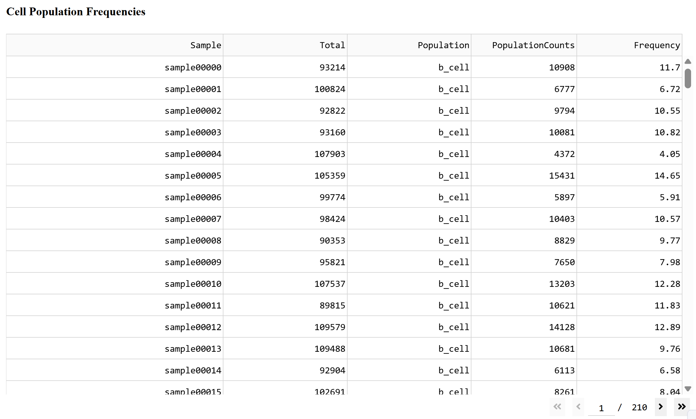
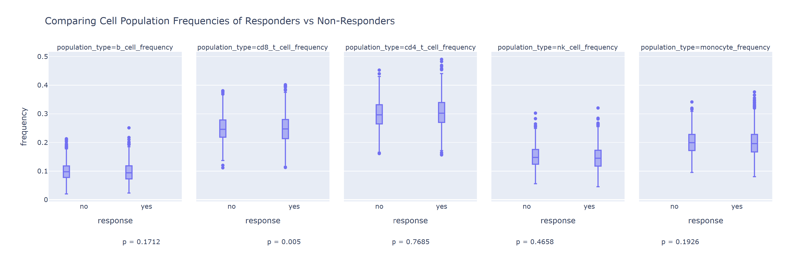
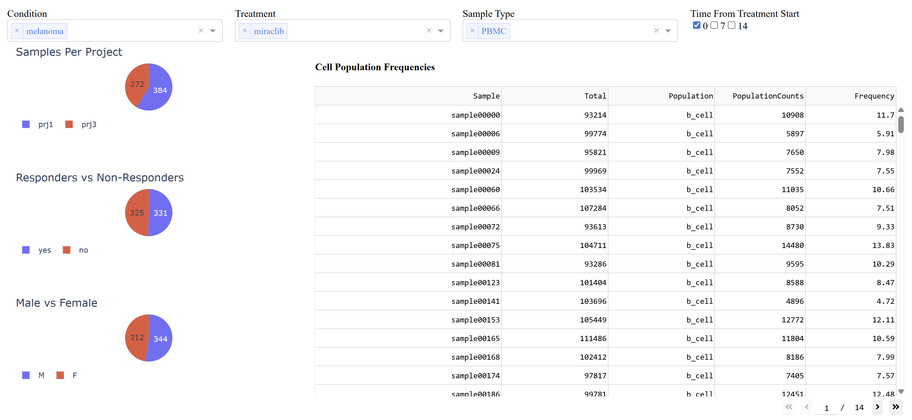

# ImmuneCellPopulationsDashboard

The purpose of this project is to create a dashboard to help a client understand how drug candidates affect immune cell population.

The repository has two main functionalities: Creating the database to store the necessary information, and rendering a dashboard that can be used to study immune cell populations and compare treatments.

## Installation Instructions

Before running any of the code, you will need to install all necessary packages. This can be done by running the following from inside the project directory:

```
 pip install -r requirements.txt 
```

## Overall Project Structure

For this project, I chose to use python dash and plotly, two libraries I don't have much experience with, but seemed like great choices for creating interactive dashboards. I wanted to create a class-based structure as much as possible, so all of the database interactions are managed by the Database class found in db.py. The main functionality of the project is located in the `intialize_db.py` file and the `app.py` file. Each of these files and use cases are described in more detail below.

## Initializing the Database

The generated database has been saved to the project for convience, but recreating the database is relatively simple. From within the project directory simply run:

``` 
python initialize_db.py 
```

If the a database is not created, this script will recreate the database, and read in the cell count data. The database schema can be found in 'schema.sql'

### Database Design

When designing the database schema, several factors were considered to attempt to make the database scalable.

The constructed database consists of 3 tables: projects, subjects, and samples.

The projects table has only one column: the project_id. This allows for additional information about the individual projects to be stored in the future.

The second table is the subjects table. It consists of the following information about individual subjects:

* subject_id: an identify for an individual subject
* condition: The subject's medical condition
* age: The subject's age
* sex: The subject's gender
* treatment: The treatment the patient has been assigned
* response: A boolean variable indicating if the subject responded to treatment
* project: A foreign key to the project the subject is associated with.

The final table is the samples table. It contains all the columns related to individual samples with the following columns:

* sample_id: an identify for the individual sample
* sample_type: the type of sample that was collected
* time_from_treatment_start: indicates the time the sample was collected relative to the time the treatment began
* b_cell: count of b_cells in the sample
* cd8_t_cell: count of cd8_t_cells in the sample
* cd4_t_cell: count of cd4_t_cells in the sample
* nk_cell: count of nk_cells in the sample
* monocyte: count of monocyte cells in the sample
* subject: A foreign key to the subject the sample was collected from.

I intentionally separated out the tables this way to reduce duplication as much as possible. 

## Loading the Dashboard

To visualize the data from the database, a python dashboard was created using plotly. Running the dashboard is relatively simple. From within the project directory, just run the following:

```
python app.py 
```

This will load the dashboard in your default browser. The dashboard consists of several visualizations including:

 * A frequency summary table to display the frequency of each population type for each sample
 * Three boxplots displaying the distribution of key variables including: whether a subject responded to treatment, sex, and samples per project
 * A boxplot visualization to compare the distribution of population frequencies between those who resonded to treatment vs those that did not respond to treatment.

 The dashboard also includes several filters to help explore the data in different ways. The available filters are:

 * Conditon: Which allows you to filter by the condition of the subject
 * Treatment: Allowing you to filter by the treatment the subject recieved
 * Sample Type: Allowinig you to filter by the type of sample
 * Time From Treatment Start: Allowing you to filter which samples are shown based on the time the sample was taken.

 These filters can be used to view the data in several ways as is shown by the examples below.

 ## Dashboard Usage Examples

### Example 1: Explore the data as is

The most simple example would be to view the data as it appears with no filters set on the dashboard. Below is shown the table visualization with no filters set on the dashboard.



### Example 2: Identify statistically significant treatment responses

The boxplot visualizations allow us to compare across subjects that responded to treatment vs those who did not respond to treatment. In this example, we want to compare the differences in cell population frequencies of melanoma patients recieving miraclib. After the relevant filters have been applied, the boxplots show the following patterns:



Looking at the p-values listed for each population type, we can see that the differences in cd8_t_cell frequencies of melanoma patients who responded to treatment with miraclib vs patients that did not respond was less than 0.05 indicating that the difference in the relative frequencies is significant.

## Example 3: Exploring Subsets

Finally, we can set several filters to explore specific subsets of the data. For example, in the screenshot below we have filtered the data to show all the melanoma PBMC samples at baseline from patients who have been treated with miraclib.



 ## Future Improvements

 While the dashboard is functional now, there are several improvements that I plan to make to improve the project. I will summarize the planned improvements below.

 * I plan to update some of the formatting of the dashboard. In particular the p-value annotations on the boxplots are not centering and after a lot of trying to fix this issue, I chose to ship as is due to time constraints.
 * I would also like to update the color palette and overall visual aspect of the dashboard. Currently the dashboard is using the default color schemes for all the visualizations. It would look better if the dashboard used a color palette based on the company.
 * Create an API for database access. Currently the code uses the database class directly to retrieve the data from the database. It would be better for the data to be served by an API.
 * Add filters to the summary dashboard. There is a lot of information in that table, so making each of the columns filterable and sortable would help the users find the information they are looking for faster.
 * When filters are updated, it takes a second for the dashboard to update with no visual indication that the dashboard is still loading. This could cause confusion, so I would like to add a loading icon while the filters are being applied.